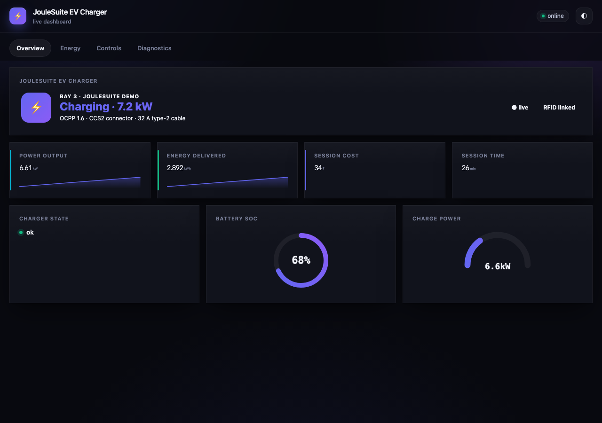
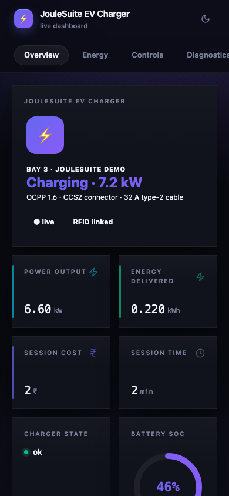
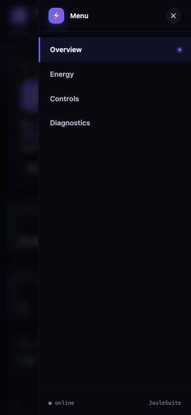

# JouleDash

> Real-time IoT dashboard for ESP32 / ESP8266 over a single WebSocket.
> **15 widget types** including donut, joystick, colour picker, custom-HTML
> escape-hatch. Multi-tab layout, dark / light / auto theme, push
> notifications, anonymous-read mode. MIT-licensed, mobile-first,
> **7 KB on the wire**.



**Author:** [Chinmoy Bhuyan](mailto:dikibhuyan@gmail.com) · **License:** MIT
· **Targets:** ESP32 (S2 / S3 / C3 / classic), ESP8266

---

## Features

| | |
|---|---|
| ⚡  **WebSocket transport** | Bi-directional, sub-100 ms updates; no SSE quirks |
| 🎨 **15 widget types** | Number · Button · Switch · Slider · Gauge · Donut · Progress · Status · Temperature · Humidity · Image · Input · Joystick · Colour · Chart · **Custom HTML** |
| 📑 **Multi-tab layout** | Group cards by `setTab("name")`; pill-style tab bar on tablet/desktop, slide-in hamburger drawer on phones |
| 🌓 **Dark / light / auto theme** | Honors `prefers-color-scheme`; user override persists in `localStorage` |
| 🎨 **Brand colour gradient** | Set with `setBrandColor()` — propagates to buttons, sliders, gauges, charts |
| 🔔 **Notifications from firmware** | `JouleDash.notify(level, msg, ttl)` pushes a toast to every connected tab |
| 🔓 **Optional anonymous-read** | View-only mode without auth; interactions can still require login |
| 🧩 **Custom-HTML widget** | Drop any DOM snippet into a card body and update it from C++ via `setValue()` |
| 📐 **12-column responsive grid** | `setWidth(N)` per card; collapses to 6-col then 2-col on small screens |
| 🪶 **7 KB on the wire** | Pre-gzipped UI served with `Content-Encoding: gzip` |
| 📱 **Touch-first** | 44 px touch targets, swipe-scrollable tabs, joystick with pointer-capture |

---

## Quick start

```cpp
#include <WiFi.h>
#include <ESPAsyncWebServer.h>
#include <JouleDash.h>

AsyncWebServer server(80);
joule::DashCard temp (joule::DashType::Number, "t",  "Temperature", "°C");
joule::DashCard led  (joule::DashType::Switch, "l",  "Onboard LED");

void setup() {
  WiFi.begin("YOUR_SSID","YOUR_PASS");
  while (WiFi.status()!=WL_CONNECTED) delay(200);

  pinMode(LED_BUILTIN,OUTPUT);
  led.onChange([](const String &v){ digitalWrite(LED_BUILTIN, v=="1"); });

  JouleDash.add(&temp);
  JouleDash.add(&led);
  JouleDash.begin(&server);          //  /, /dash, /dash/ws
  server.begin();
}

void loop() {
  static uint32_t t=0;
  if (millis()-t > 1000) { t=millis(); temp.setValue(readSensor()); }
  JouleDash.tick();                  // pushes dirty cards (≤10 Hz default)
}
```

Open `http://<device-ip>/` — done.

---

## Widget catalogue

Every widget is declared as a `DashCard` and exposed via the same
`add()` → `setValue()` → optional `onChange()` flow.

### Numeric & textual

| Type | Code | Renders as |
|---|---|---|
| `Number` | `DashCard(DashType::Number, "t", "Temp", "°C")` | Large numeric value with unit suffix |
| `Temperature` | `DashCard(DashType::Temperature, "t", "Temp", "°C")` | Same as Number with a thermometer-y label tint |
| `Humidity` | `DashCard(DashType::Humidity, "h", "Humidity", "%")` | Same as Number with a humidity-y label tint |
| `Status` | `DashCard(DashType::Status, "s", "Charger")` | Coloured pill + text; auto-classifies the value: `ok/online/connected` → green, `warn` → amber, `err/off/fail` → red |
| `Input` | `DashCard(DashType::Input, "name", "Note")` | Text input. `onChange` fires on Enter/blur |

### Interactive controls

| Type | Code | Renders as |
|---|---|---|
| `Button` | `DashCard(DashType::Button, "rb", "Reboot")` | Click → `onChange("1")` + a brief glow animation |
| `Switch` | `DashCard(DashType::Switch, "led", "LED")` | Toggle; click or Space/Enter; `onChange("1"/"0")` |
| `Slider` | `DashCard(DashType::Slider, "b", "Bright", "%")` then `setRange(0,100); setStep(1)` | Range slider with live value bubble |
| `Joystick` | `DashCard(DashType::Joystick, "j", "Joystick")` | Round pad; drag → `onChange("x,y")` in [-100, 100] |
| `Color` | `DashCard(DashType::Color, "c", "Accent")` | Native colour picker + hex readout |

### Indicators

| Type | Code | Renders as |
|---|---|---|
| `Progress` | `DashCard(DashType::Progress, "p", "Cycle", "%")` + `setRange(0,100)` | Brand-gradient bar with glow |
| `Gauge`    | `DashCard(DashType::Gauge,    "g", "CPU",   "%")` + `setRange(0,100)` | Half-circle SVG arc with gradient stroke |
| `Donut`    | `DashCard(DashType::Donut,    "d", "Battery","%")` + `setRange(0,100)` | Full SVG ring with centred % readout |
| `Chart`    | `DashCard(DashType::Chart, "ch", "Trend")` then `chartPushXY(x,y)` | Line/area chart; gridlines + last-point dot |
| `Image`    | `DashCard(DashType::Image, "i", "Cam")` then `setValue(base64_png)` or `setValue("https://…")` | `` rendered inline |
| `Custom`   | `DashCard(DashType::Custom, "x", "Misc")` then `setCustomHtml("<…>")` | Arbitrary HTML you control. See **Custom-HTML widget** below |

---

## API reference

### `DashCardBase`

```cpp
DashCardBase(DashType t, const String &id, const String &label);
DashCardBase(DashType t, const String &id, const String &label, const String &unit);
DashCardBase(DashType t, const String &id, const String &label, const String &unit, float lo, float hi);
```

#### Layout

```cpp
void setLabel (const String &s);
void setUnit  (const String &s);
void setColor (DashColor c);              // Default / Success / Warning / Danger / Info / Primary
void setTab   (const String &t);
void setHidden(bool h);
void setWidth (uint8_t cols);             // 1..12 in the grid; 0 = auto
```

#### Value setters (overloaded)

```cpp
void setValue(int);          // also unsigned, long
void setValue(float, int digits = 2);
void setValue(double, int digits = 2);
void setValue(bool);                       // "1" or "0"
void setValue(const char *);
void setValue(const String&);
```

#### Range (slider / gauge / progress / donut / number)

```cpp
void setRange(float lo, float hi);
void setStep (float step);
```

#### Chart helpers

```cpp
void chartPushXY (float x, float y);                    // rolling buffer
void chartSetSeries(const float *xs, const float *ys, size_t n);
void chartSetMaxPoints(size_t n);                       // default 50
void chartSetType(ChartType t);                         // Line | Bar | Area
```

#### Custom widget

```cpp
void setCustomHtml(const String &html);
```

Set an HTML snippet to render inside the card body. If the snippet
includes `<span id="dash-<cardId>-out"></span>`, the runtime injects the
card's `setValue()` text into that span on every broadcast. For richer
interactions, listen for `joulevalue` events on the snippet's root.

#### Callback

```cpp
using DashChangeCb = std::function<void(const String &payload)>;
void onChange(DashChangeCb cb);
```

Fires when a user interacts with this widget (button click, switch
toggle, slider drag, joystick move, colour pick, input change). The
`payload` is the new value as a string.

### `JouleDashClass`

```cpp
void begin(AsyncWebServer *server,
           const String &username = "",
           const String &password = "",
           bool allowAnonymousRead = false);

void add(DashCardBase *card);              // register a card (raw pointer; outlive JouleDash)
void refreshLayout();                       // force a re-push of layout to all clients
void tick();                                // call from loop(); coalesced push of dirty cards

void addTab(const String &name);

void setTitle              (const String &t);
void setBrandColor         (const String &cssColor);
void setTheme              (const String &t);          // "dark" / "light" / "auto"
void setMinPushIntervalMs  (uint32_t ms);              // default 100 → ≤10 Hz

void notify(NotifyLevel lvl, const String &msg, uint32_t ttlMs = 5000);
```

`NotifyLevel`: `Info` · `Success` · `Warn` · `Error`.

---

## HTTP & WebSocket protocol

### HTTP

| Path | Description |
|---|---|
| `/`        | 302 → `/dash` |
| `/dash`    | The dashboard SPA |
| `/dash/ws` | WebSocket endpoint (upgrade required) |

### WebSocket frames (JSON, one per text frame)

**Server → client:**

```jsonc
// On connect (and on refreshLayout()):
{
  "type":  "layout",
  "title": "JouleSuite Dashboard",
  "brand": "#7c5cff",
  "theme": "auto",
  "tabs":  ["Overview","Controls","Charts"],
  "cards": [
    { "id":"t",  "type":"temperature", "label":"Temp",
      "unit":"°C", "color":"info", "tab":"Overview",
      "min":0, "max":100, "step":1, "width":3,
      "hidden":false, "chartType":"line", "value":"" },
    …
  ]
}

// Value update batch:
{
  "type":  "upd",
  "cards": [ {"id":"t","value":"22.4"}, {"id":"led","value":"1"}, … ]
}

// Toast:
{ "type":"notify", "level":"success", "message":"Update applied", "ttl":5000 }
```

**Client → server:**

```jsonc
{ "type":"cmd",   "id":"led", "value":"1" }   // user interaction
{ "type":"hello" }                            // request fresh layout
```

When the server receives a `cmd` it:

1. Updates the card's stored value
2. Calls the card's `onChange()` callback (host C++ does work here)
3. **Re-broadcasts** the value to every connected tab so all clients
   stay in sync

---

## UI walkthrough

| Region | Contents |
|---|---|
| Header | App icon · title · live status pill · theme toggle (◐) |
| Tab bar | Horizontally-scrolling, brand-gradient highlight on active |
| Grid | 12-column responsive grid; cards have glass-morphism, hover lift, branded accents per `DashColor` |
| Toast stack | Bottom-right; auto-dismiss after `ttl`; colour-coded by level |

Mobile (390 px wide):

| Phone — Overview tab | Phone — Hamburger drawer |
|---|---|
|  |  |
| KPI cards collapse to 2-up pairs, sparkline + Lucide icon stay legible, hero card stacks vertically with brand-gradient title. | Tap the `☰` icon in the header (right side) and the tab list slides in from the right. Active tab gets a brand accent strip + pulse dot. Dismiss via the `X`, a backdrop tap, or ESC. |

The grid collapses to **6 columns ≤ 760 px** and **2 columns ≤ 420 px**.
Below 420 px the horizontal tab bar is replaced by a slide-in drawer so a
narrow viewport never has tabs hidden off-screen.

---

## Patterns

### React to a slider

```cpp
joule::DashCard bright(joule::DashType::Slider, "b", "Brightness", "%");
bright.setRange(0, 255);

void setup() {
  bright.onChange([](const String &v){
    ledcWrite(0, v.toInt());        // PWM on LEDC channel 0
  });
  JouleDash.add(&bright);
}
```

### React to a button

```cpp
joule::DashCard reboot(joule::DashType::Button, "rb", "Reboot");
reboot.setColor(joule::DashColor::Danger);
reboot.onChange([](const String &){
  JouleDash.notify(joule::NotifyLevel::Warn, "Rebooting in 1s", 1000);
  delay(1100);
  ESP.restart();
});
```

### Push a notification from firmware

```cpp
JouleDash.notify(joule::NotifyLevel::Success,
                 String("MQTT connected to ") + brokerHost, 4000);
```

### Plot a time-series

```cpp
joule::DashCard tempChart(joule::DashType::Chart, "tc", "Temperature");
tempChart.setWidth(12);
tempChart.chartSetType(joule::ChartType::Area);
tempChart.chartSetMaxPoints(120);

void loop() {
  if (timeForNewSample()) tempChart.chartPushXY(millis()/1000.0f, readTemp());
  JouleDash.tick();
}
```

### Custom HTML widget — embed a graph, gauge, or anything

```cpp
joule::DashCard custom(joule::DashType::Custom, "cus", "Charger state");
custom.setWidth(12);
custom.setCustomHtml(R"(
  <div style='display:flex;gap:18px;align-items:center'>
    <div style='font-size:34px'>⚡</div>
    <div>
      <div style='font-size:11px;color:var(--muted)'>Current draw</div>
      <div style='font-family:monospace'>last tick: <span id='dash-cus-out'>—</span></div>
    </div>
  </div>
)");

void loop() {
  custom.setValue(String(currentA(), 1) + " A");   // updates #dash-cus-out
  JouleDash.tick();
}
```

For full interactivity, listen for `joulevalue` events on the snippet
root in your own `<script>` block within `setCustomHtml`.

### Anonymous read, authenticated write

```cpp
JouleDash.begin(&server, "admin", "joule", /*allowAnonymousRead=*/true);
```

Anyone can view the dashboard; only authenticated tabs can send `cmd`
frames. Useful for shop-floor displays.

### Multi-tab layout

```cpp
JouleDash.addTab("Overview");
JouleDash.addTab("Controls");
JouleDash.addTab("Charts");

cTemp .setTab("Overview");
cLed  .setTab("Controls");
cChart.setTab("Charts");
```

---

## Theme + brand colour

* **Auto** (default) honours the user's OS preference.
* **Brand colour** is a single hex (`setBrandColor("#7c5cff")`) that
  drives gradients on buttons, sliders, gauges, chart lines, donut
  strokes, focus rings and selected tabs.
* The user can override via the ◐ icon in the header; the choice
  persists per browser in `localStorage["joule-theme"]`.

---

## Update cadence

`JouleDash.tick()` coalesces dirty cards into a single push at most every
`setMinPushIntervalMs(100)` ms (default 10 Hz). Increase the throttle
for high-frequency telemetry (`setMinPushIntervalMs(40)` for 25 Hz) or
relax it on weak Wi-Fi (`setMinPushIntervalMs(500)`).

The push is **delta-only** — only cards whose `setValue()` produced an
actual change since the last tick are included.

---

## Troubleshooting

| Symptom | Cause | Fix |
|---|---|---|
| WebSocket connects then disconnects every few seconds | Page tab is in the background and the browser throttles WS | Use `notify()` for important state; the UI will reconcile on focus |
| Layout doesn't show new cards I `add()`-ed at runtime | Layout is cached on the client | Call `JouleDash.refreshLayout()` |
| Slider value snaps back to the old value when I drag | Two clients fighting over the value | This is intentional — the last cmd wins. Coordinate via your own state machine |
| `Chart` widget is blank | No data pushed yet, or `chartPushXY` xs are not monotonic | Push at least one point; xs are treated as ordered |
| `Custom` widget value not updating | No `<span id="dash-<id>-out">` in the HTML | Add one, or listen for `joulevalue` events on the snippet root |

---

## Dependencies

* `ESP32Async/ESPAsyncWebServer @ ^3.7.0`
* `ESP32Async/AsyncTCP @ ^3.4.0`
* `bblanchon/ArduinoJson @ ^7.4.0`
* arduino-esp32 core 3.x (for `AsyncURIMatcher::exact()`)

---

## License

MIT — see [LICENSE](LICENSE).

---

<sub>**Author:** Chinmoy Bhuyan · **Email:** dikibhuyan@gmail.com · **(c)** 2026 — MIT</sub>
